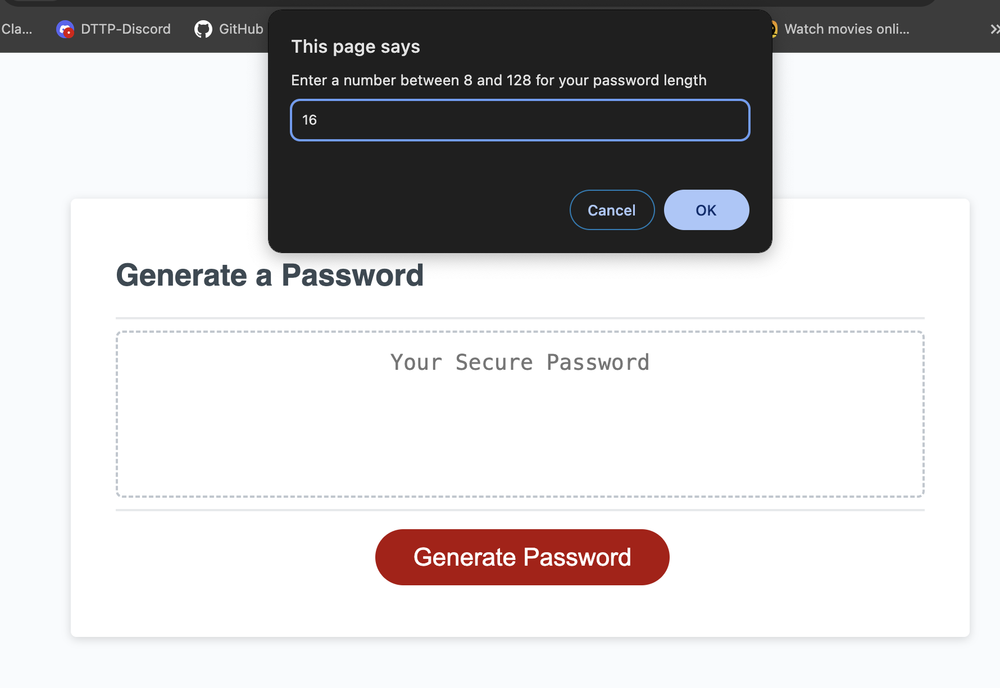
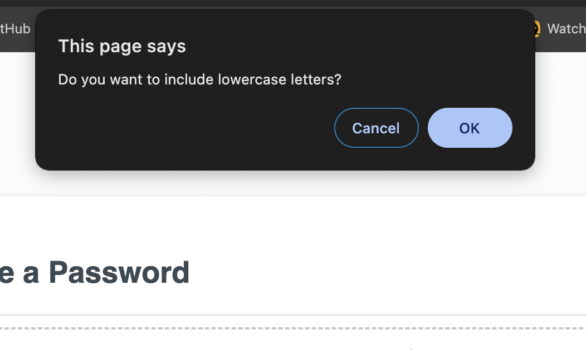
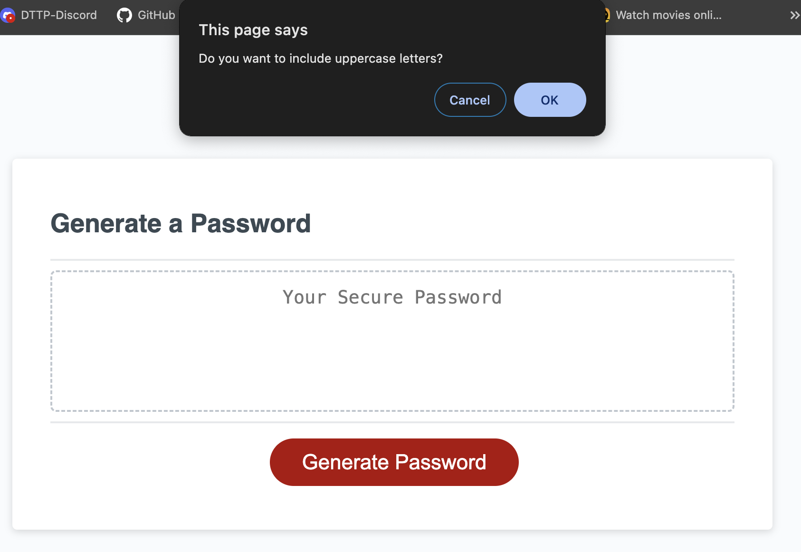
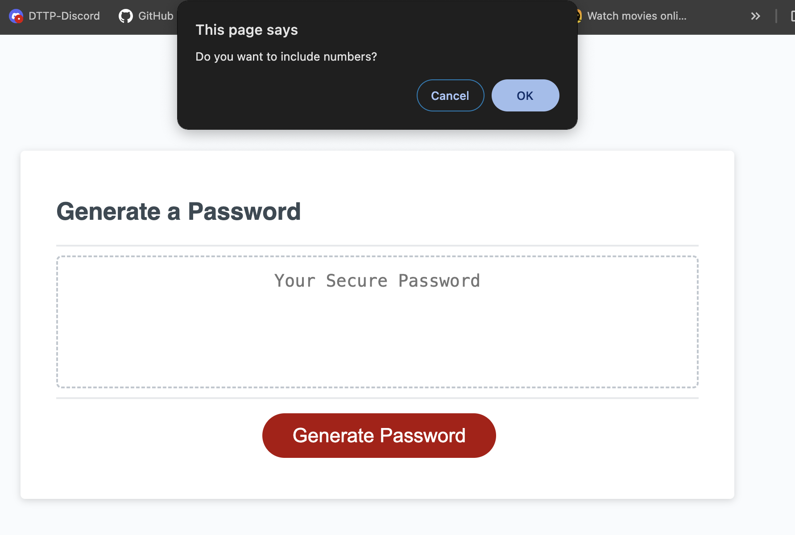
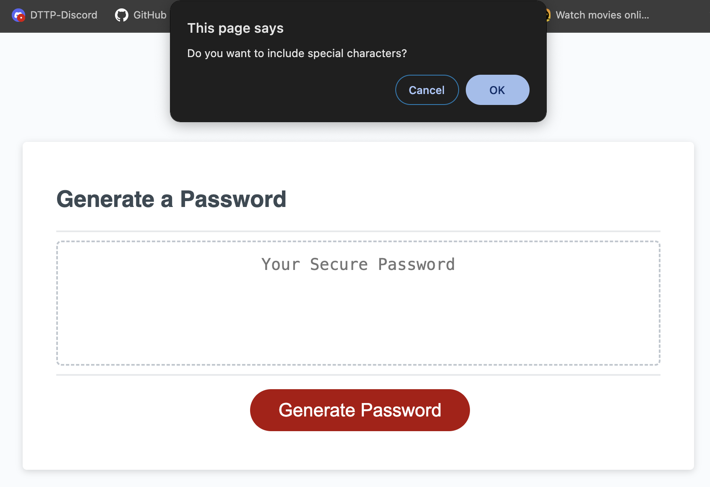
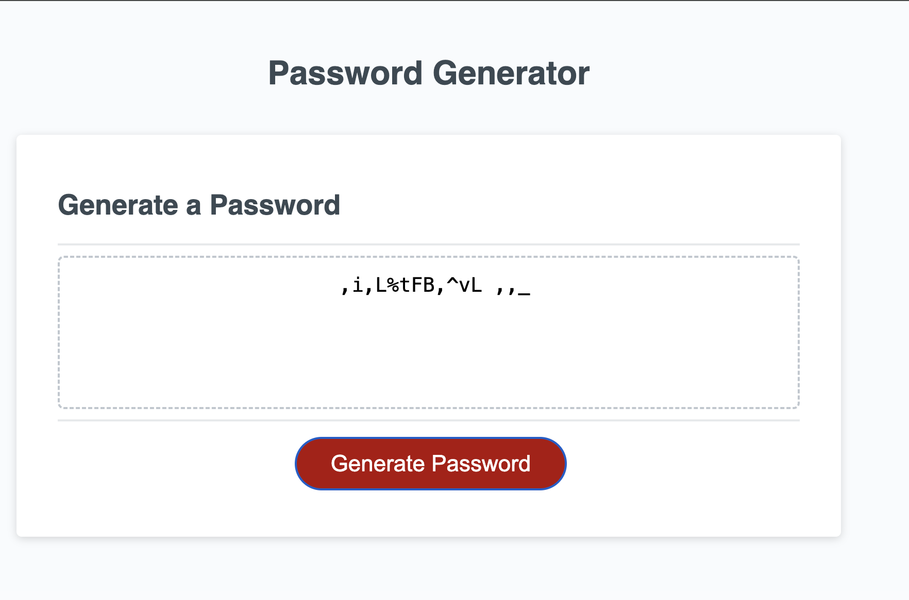
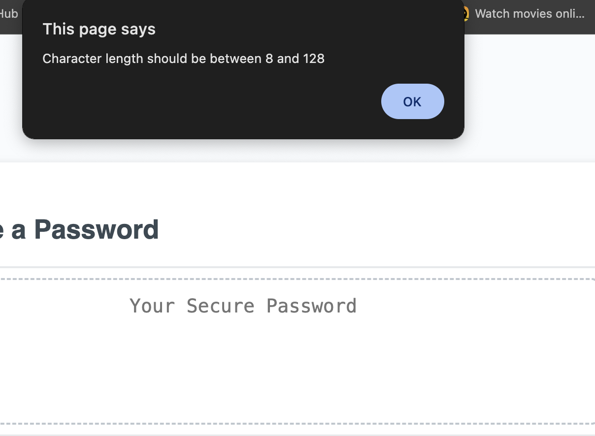
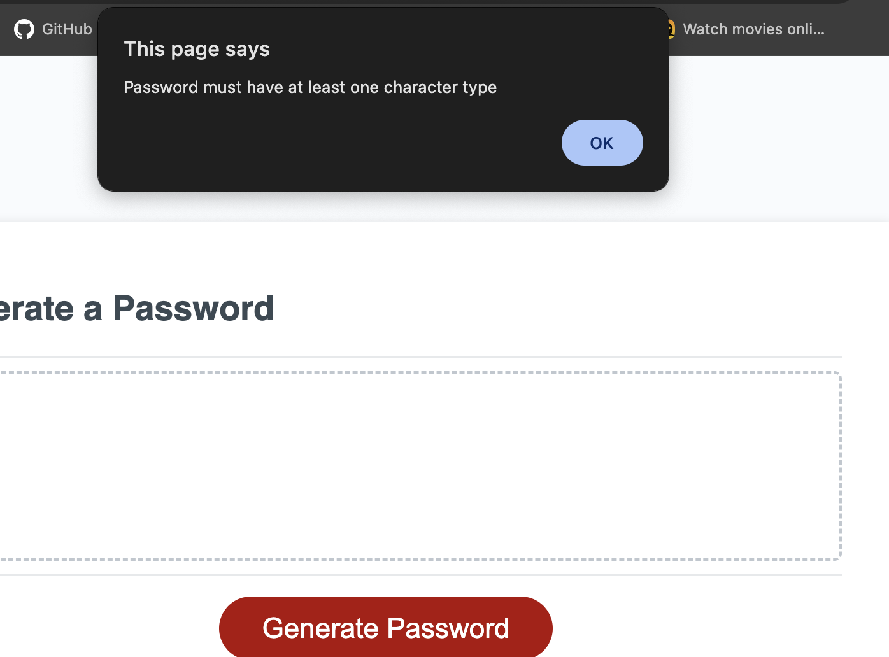

# passwordmaster
This repository is for skillhat DTTP class to create a password generator.
This project was interesting because almost every thing requires a password and for safety its best to not reuse passwords. Now I have my own personal generator.

Password generator should be able to create random password that can be between 8 to 128 characters long.

The password to be generated can include lowercase, uppercase, numerical and special characters. User has to specify at least one type for the genrator to run.

Once prompts are answered then the password should be generated and displayed on the page in a text area.

The html code and css style for this was provided along with a starter javascript code.

The most challenging part of this project was figuring out how to return random characters for each type. Eventually found the array method concat().
Also how to convert boolean value to integer since the length needed to be read as a value. Initialy tried to use the number() but I was getting confused with the variable names so found the alternative parseInt().

I might add a console log to the code later.

See screenshots below of the outcomes

url to generator: https://kmobatusin.github.io/passwordmaster/
url to repository: https://github.com/KMOBATUSIN/console-finances

